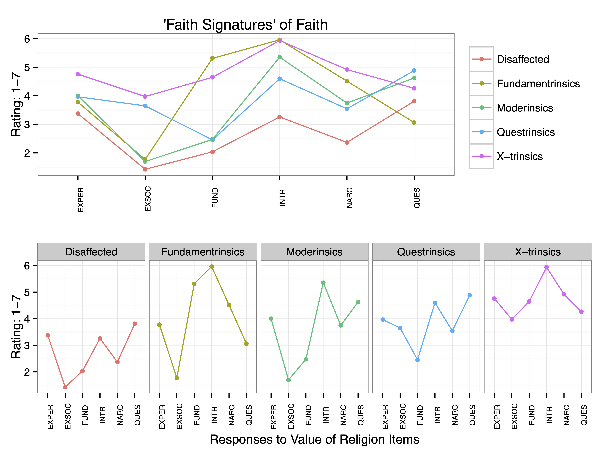

```{r setup, include=FALSE}
knitr::opts_chunk$set(
  echo = FALSE, cache = TRUE, fig.align = 'center'
)
```

## New Zealand's religious diversity

[Here](https://www.dropbox.com/s/94vvjt5qup6j4pz/Chelsey%20Gardiner_300441422_Presentation.pptx?dl=0)

```{r echo=F}

```


## Links to readings


Wilson, J. Bulbulia, and C. G. Sibley. Differences and similarities in religious and paranormal beliefs: a typology of distinct faith signatures. Religion, Brain and Behavior, 1–23, 2015 [link](https://www.tandfonline.com/doi/full/10.1080/2153599X.2013.779934)

Bulbulia, J. A., Troughton, G., Highland, B. R., & Sibley, C. G. (2020). A national-scale typology of orientations to religion poses new challenges for the cultural evolutionary study of religious groups. Religion, Brain & Behavior, 10(3), 239-251.[link](https://doi.org/10.1080/2153599X.2019.1678516)
