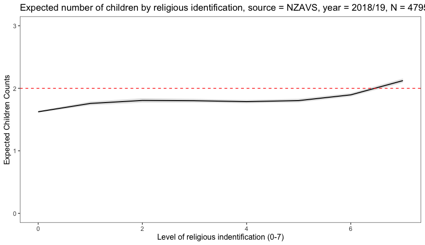

```{r setup, include=FALSE}
knitr::opts_chunk$set(
  echo = FALSE, cache = TRUE, fig.align = 'center'
)
```

## What is culture?


```{r maur1, echo=F}
knitr::include_graphics("jb.png")
```

We define culture in a broadly to socially transmitted and acquired information information that affects and enables human cognition and behavior. That's not perfect. For example, its clear that birds, chimps, and other organisms have culture, however, this definition makes a start. 

## What is evolution? 


```{r nowak, layout="l-body-outset", fig.width=6, fig.height=1.5, fig.cap="\\label{fig:nowak} From Martin Nowak's Five Rules For The Evolution of Cooperation"}
knitr::include_graphics("nowak.png")
```
We define evolution as a process by which design accumulates in living systems under the following conditions: 

  1. Variation within a population
  2. Competition among variants 
  3. Inheritance such that there is a faithful transmission to "children" of "parental" traits.
  
Here too, we have only an approximate definition to make a start.^[Source of image Martin' Nowak's Five Rules for the Evolution of Cooperatoin [here](https://www.researchgate.net/figure/Without-any-mechanism-for-the-evolution-of-cooperation-natural-selection-favors_fig2_6641993)] 


## Why combine culture and evolution? 

When defining evolution we used shutter quotes for "children" and "parents" because evolution is not restricted to biological inheritance. There are evolutionary patterns at the level of culture. 

There are three main benefits for combining culture and evolution:

  1. to clarify otherwise bewildering cultural diversity;
  2. to unlock wisdom in culturally inherited systems;
  3. to avoid to cultural evolved inequality.   
  
## Focus on Religion

### Evolutionary Puzzle 1: religion appears to be biologically costly


```{r  pain1, layout="l-body-outset", fig.width=6, fig.height=1.5, fig.cap= "\\label{fig:pain1} What is the Expression on this woman's face?"}
knitr::include_graphics("pain1.png")
```

Figure \@ref(fig:pain1) is photograph that my colleague Ron Fischer took when were in Mauritius investigating the emotional dynamics in highly arousal rituals. What expression is the woman conveying in this image? 

  
```{r  pain2, layout="l-body-outset", fig.width=6, fig.height=1.5, fig.cap= "\\label{fig:pain2} Biological puzzle of costs"}
knitr::include_graphics("pain2.png")
```
  
If you guessed sorrow, you are correct. The woman was weeping so loudly that the little boy in the background had to cup his ears (See Figure \@ref(fig:pain2)).

From a biological vantage point, we might a species to actively avoid unnecessary suffering and bodily damage. However, as we shall reapedly see throughout this course, rituals are frequently associated with costs and risks. As evident in Figure \@ref(fig:nowak), conservation implies adaptation. Where's the adaptation in costly rituals? Why, are costly rituals conserved? 

<aside>
  ```{r sadhu, fig.width=8, fig.height=3.5, fig.cap="\\label{fig:sadhu} Hindu Sadus actively destroy reproductive futures. This is biologically puzzling"}
knitr::include_graphics("cost.png")
```
</aside>

The image in Figure  \@ref(fig:sadhu) is of a Sadhu. A Sadhu is a religious ascetics who take vows of self-denial to achieve ”mosksha” – which in the Hindu tradition is a state of liberation.  The acetic regimes are associated with contemplative practices such as prayers and mantra recitations.  The austerity is thought to remove the spiritual effects of karma (action) which cause ,may cause future states of unhappiness.  Why would an anthropologist from Mars be puzzled by these Hindu Saddhus?


### Evolutionary Puzzle 2: Religion is ancient

On the human capacity to fathom geological time scales, Darwin writes:

> It is hardly possible for me even to recall to the reader, who may not be a practical geologist, the facts leading the mind feebly to comprehend the lapse of time ... 
  – Charles Darwin, Origins of Species, p.283
>
> It strikes me that all our knowledge about the structure of our Earth is very much like what an old hen would know of the hundred-acre field in a corner of which she is scratching.
  –Charles Darwin, Life and Letters of Charles Darwin vol 2,  p.348) 


We tend to think of the ancient Greeks and Romans as inhabiting the deep human past. However anatomically modern humans have been around about 200,000 years. 

  ```{r rold, layout="l-body-outset", fig.width=6, fig.height=1.5, fig.cap="\\label{fig:rold}Evidence for ritual at least 150kya"}
knitr::include_graphics("rold.png")
```

Rituals have been around as long as humans have been around, and perhaps longer. The Figure \@ref(fig:rold) draws the archeological evidence for rituals on a time line. 

Here's a thought experiment: 

Imagine that distance from the present to the origins of Christianity (about 2000 years) is one step. 

Note that it would take another 15 steps before we reached the evidence of supernatural art in European caves Clottes and Chauvet. Go ahead and find a place were you can walk 15 steps. As you are counting, imagine the passing of 2000 years with each pace. During those spans of time, there were humans just like you and I who were getting on with the business of their lives. 

Double that distance again, and we reach the Blombos caves in South Africa, where archeologists describe function-less artifacts that indicate (to archeologists, anyway) evidence of symbolic thinking. 

Add another 15 paces and we arrive at Quafez burials of Hominins close relatives the neanderthals. The layout of a child's grave with artefacts and attentive orientation appears to signify a supernatural drama. Were these thoughts religious? 

Finally, it will take us another 25 steps to reach the Herto finds in Ethiopia, where Tim White found skulls with etchings indicting that they were fastened to chords and swung. Were the rituals imagining an afterlife into which the dead travelled? 

Of course, we can only speculate about the events of the deep ancestral human past. However, the fact that people were engaging in symobolic rituals is consistent with supernatual speculation.  Why was religion conserved all that time? 

<aside>
Netflix advice: watch Werner Herzog's *Caves of Dreams*, which describes this rediscovery of Chauvet in the late 20th century.
</aside>


### Evolutionary Puzzle 3: Religion is pervasive, and growing 


The Pew Foundation predicts that the proportion of the religious population will *grow* in the future. ^[For more information on the Pew Foundations forcasts for the religion in the future go [here](http://www.globalreligiousfutures.org/)]


```{r  fc, layout="l-body-outset", fig.width=6, fig.height=1.5, fig.cap= "\\label{fig:fc}Pew predicts the world we encounter in the decades ahead will be increasingly religious"}
knitr::include_graphics("forcast.png")
```


Roughtly speaking religious change at the population level is a function of two processes: 
  1  religious conversion/deconversion
  2. birthrates of religious and non-religous people

There are only two pathways for having a religion or losing religion. You are born into a family that has/doesn't have a religion.  You convert/de-convert.  Figure \@ref(ch) presents the expected number of children by for people living in New Zealand by religious affiliation. The redline is the biological replacement threshold of 2 x children (for a population to maintain its numbers each person must have an average of 2 x kids because each child has 2 x parents). 

```{r ch, layout="l-body-outset", fig.width=6, fig.height=1.5, fig.cap="\\label{fig:ch}Highest levels  of religious identification predict more children"}

```

### Religion in your backyard


```{r ch_wl, layout="l-body-outset",fig.width=6, fig.height=1.5, fig.cap="\\label{fig:ch_wl}Places of faith in Wellington"}
knitr::include_graphics("ch_wl.png")
```


```{r  ch_hutt, layout="l-body-outset",fig.width=6, fig.height=1.5, fig.cap="\\label{fig:ch_hutt}Places of faith in Upper Hutte"}
knitr::include_graphics("ch_hutt.png")
```


```{r  ch_petone, layout="l-body-outset",fig.width=6, fig.height=1.5, fig.cap="\\label{fig:ch_petone}Places of faith in Petone"}
knitr::include_graphics("ch_petone.png")
```


```{r  alnoor, layout="l-body-outset",fig.width=6, fig.height=1.5, fig.cap="\\label{fig:alnoor}Diversity of one mosque: Al Noor (Christchurch"}
knitr::include_graphics("alnoor.png")
```


## What will I be doing in this course? 

Expectations:

  - 5 x article “peer” review reports of an assigned reading = 25%.
  - 10 x class participation + engagement points = 10%.
  - 1 x student led presentation = 10%.
  - 1 x Grant application initial proposal = 15% “application inquiry” – or preliminary plan.
  - 1 x "Grant application final grant = 40%
  
  
## Sign up for the class participation here

```{r bb, layout="l-body-outset",fig.width=6, fig.height=1.5, fig.cap="\\label{fig:bb}Blackboard sign up"}
knitr::include_graphics("bb.png")
```

  
## How will this course benefit me? 

  1. Knowledge of cultural evolutionary theory and research
  2. Presentation skills
  2. Critical sympathetic writing.
  3. Skills for organising a research idea, and pitching it to a potential funder.


## Slide deck

Click [here](slides_1.html) to go to the slide deck.

```{r embed-xaringan, layout="l-body-outset"}
xaringanExtra::embed_xaringan(url = "slides_1.html", ratio = "4:3")
```

## Help

You can email me for an appointment at: joseph.bulbulia@vuw.ac.nz or drop by my office hours: [here](https://josephbulbulia.netlify.app/)

## Readings

No readings this week, but check out some cultural databases and websites:

[D-PlACE](https://d-place.org/)

[Pulotu](https://pulotu.shh.mpg.de/)

[Database of Religious History](https://religiondatabase.org/landing/)

[Seshat](http://seshatdatabank.info/)

[Cultural diversity at the Al Noor Mosque](https://uoa-eresearch.github.io/religion/al_noor_mosque/)

[Cultural diversity in New Zealand as recorded by the New Zealand Attitudes and Values Study](https://uoa-eresearch.github.io/nzavs/)

[Global church map](https://uoa-eresearch.github.io/religion/churches.html)
