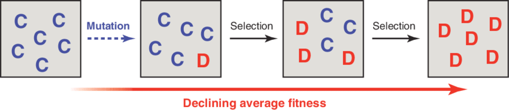
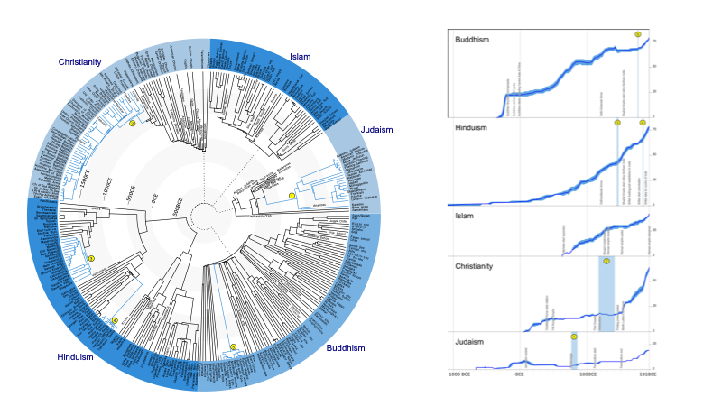
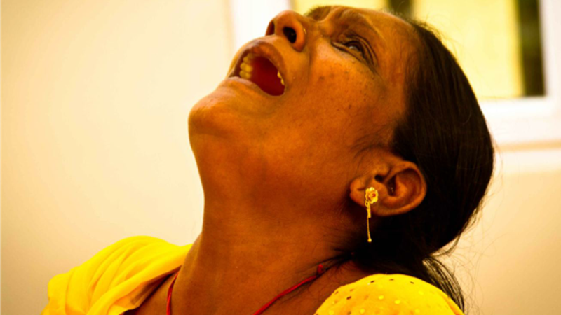
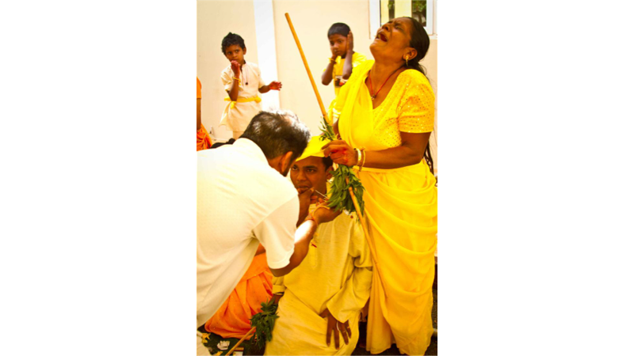
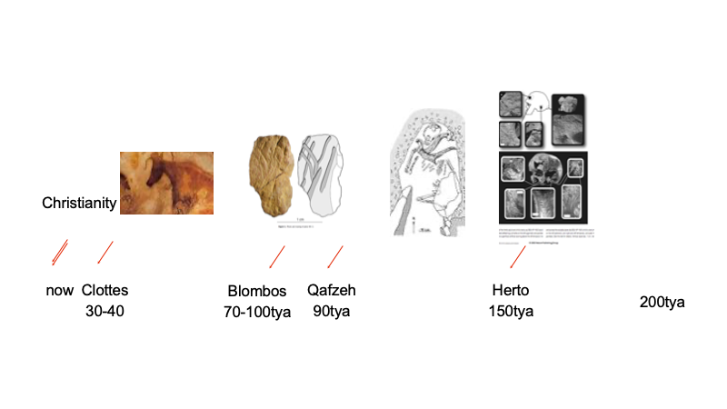
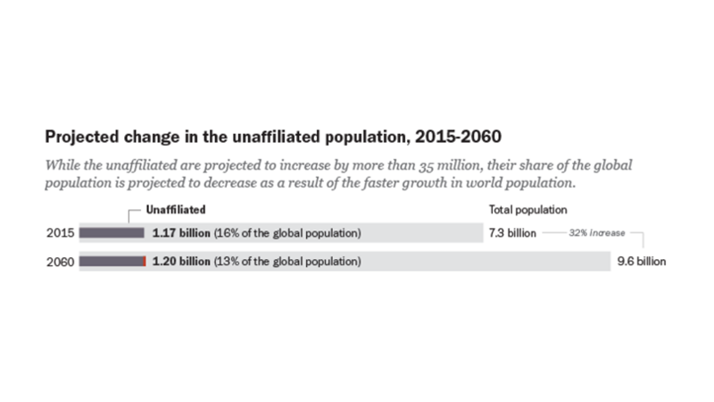
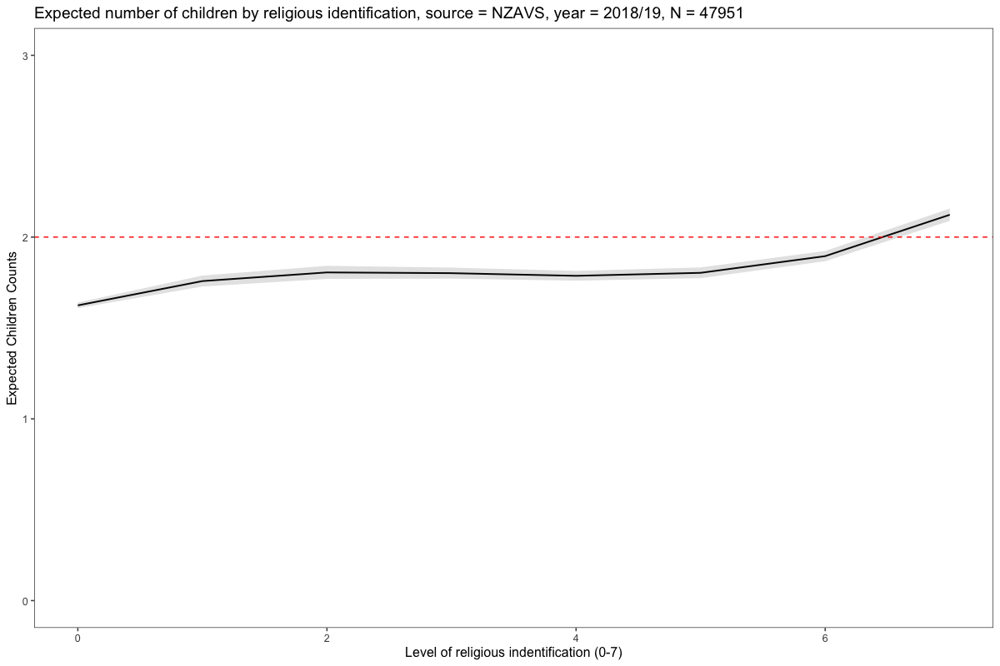
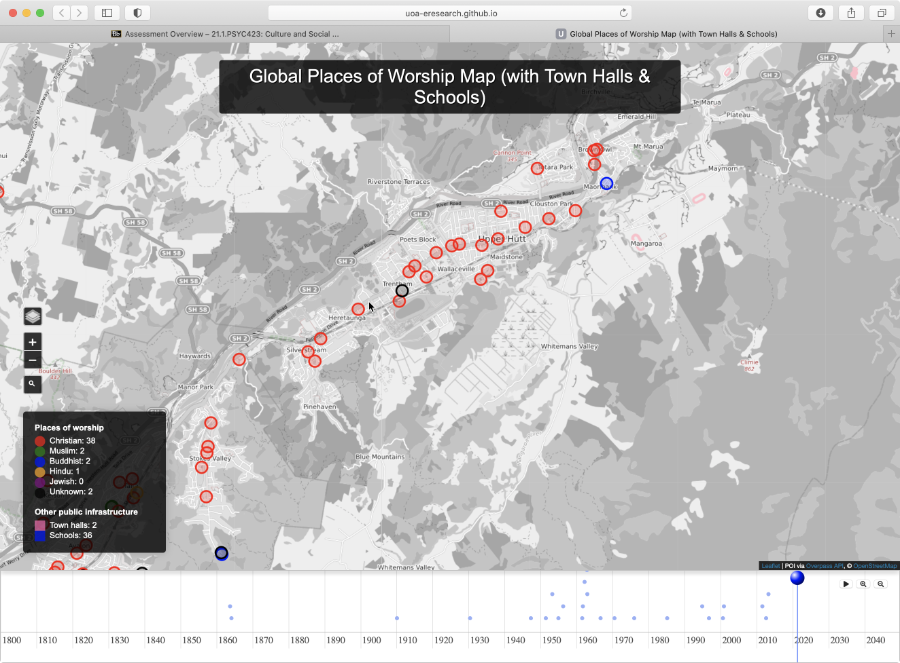
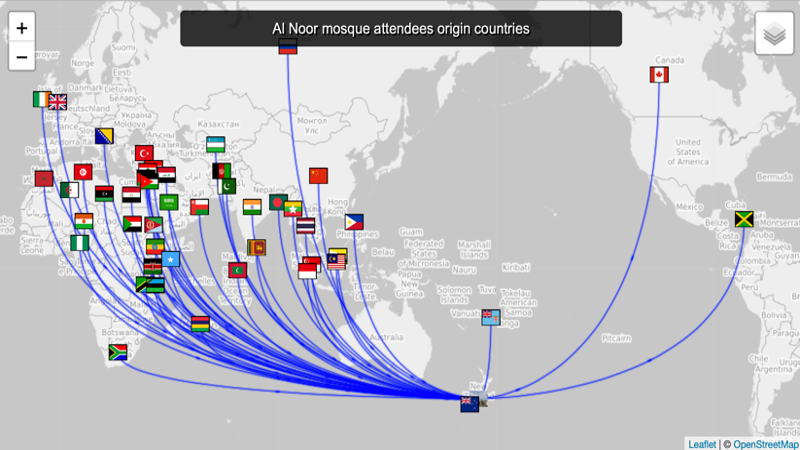

```{r setup, include=FALSE}
# Packages
library(scales)
library(here)
library(knitr)
library(kableExtra)
library(ggdist)
library(bayesplot)
library(tidyverse)
# knitr chunk options
opts_chunk$set(
  echo = FALSE, 
  cache = TRUE,
  message = FALSE,
  warning = FALSE,
  dev = "svg",
  fig.align = 'center'
  )
# Bayesplot color theme
color_scheme_set("darkgray")
```

## Welcome

Welcome!

<div class="notes">
Greetings everyone, welcome to Psyc 423: Culture and Social Behaviour.
I'm Joseph Bulbulia and I will be your instructor. 
</div>


## What will I be doing in this course? 

  - 5 x article “peer” review reports of an assigned reading = 25%.
  - 10 x class participation + engagement points = 10%.
  - 1 x student led presentation = 10%.
  - 1 x Grant application initial proposal = 15% “application inquiry” – or preliminary plan.
  - 1 x "Grant application final grant = 40%
  
  
## Sign up

```{r bb, layout="l-body-outset", out.width = "1000px"}

```


## What is culture?

We define culture in a broadly to socially transmitted and acquired information information that affects and enables human cognition and behavior. That's not perfect. For example, its clear that birds, chimps, and other organisms have culture, however, this definition makes a start. 

## What is evolution? 


```{r nowak, layout="l-body-outset", out.width = "1000px"}

```
  
## Why combine culture and evolution? 

  1. to clarify otherwise bewildering cultural diversity;
  2. to unlock wisdom in culturally inherited systems;
  3. to avoid to cultural evolved inequality.   
  

## Religions prominently display cultural variation

```{r  religions, layout="l-body-outset",  out.width = "1000px"}
knitr::include_graphics("religions.png")
```


## Variation of Warblers

```{r  birds, layout="l-body-outset",  out.width = "1000px"}
knitr::include_graphics("birds.png")
```
## Warbler Phylogeny

```{r  birdsphy, layout="l-body-outset",  out.width = "1000px"}
knitr::include_graphics("birds_phy.png")
```

## Religion phylogeny

```{r  religionsphy, layout="l-body-outset",  out.width = "1000px"}

```


### Evolutionary Puzzle 1| cost


```{r  pain1, layout="l-body-outset",  out.width = "1000px"}

```

## Why cost? 
```{r  pain2, layout="l-body-outset",  out.width = "1000px"}

```

## Evolutionary Puzzle 2| Religion is ancient

## Darwin 

> It is hardly possible for me even to recall to the reader, who may not be a practical geologist, the facts leading the mind feebly to comprehend the lapse of time ... 
  – Charles Darwin, Origins of Species, p.283

## Darwin 
> It strikes me that all our knowledge about the structure of our Earth is very much like what an old hen would know of the hundred-acre field in a corner of which she is scratching.
  –Charles Darwin, Life and Letters of Charles Darwin vol 2,  p.348) 

## Timeline

  ```{r rold, layout="l-body-outset", out.width = "1000px"}

```

## Evolutionary Puzzle 3 | Growth


```{r  fc, layout="l-body-outset",  out.width = "1000px"}

```


## New Zealand forcast

```{r pewnz, layout="l-body-outset",  out.width = "1000px"}
knitr::include_graphics("pewnz.png")
```


## Birthrate NZ

```{r ch, layout="l-body-outset",  out.width = "1000px"}

```


### Religion in your backyard

```{r chwl, layout="l-body-outset", out.width = "1000px"}
knitr::include_graphics("ch_wl.png")
```

## Hutt

```{r  chhutt, layout="l-body-outset", out.width = "1000px"}

```

## Petone

```{r  chpetone, layout="l-body-outset", out.width = "1000px"}
knitr::include_graphics("ch_petone.png")
```

## Al Noor

```{r  alnoor, layout="l-body-outset", out.width = "1000px" }

```

## Summary 

- Culture and evolution 
- Case of religion 
- Cost Puzzle
- Endurance Puzzle
- Ubiquity Puzzle
- Also, religion is still prominent, and perhaps will be increasingly so.

## Help

joseph.bulbulia@vuw.ac.nz 

## Links

[D-PlACE](https://d-place.org/)

[Pulotu](https://pulotu.shh.mpg.de/)

[Database of Religious History](https://religiondatabase.org/landing/)

[Seshat](http://seshatdatabank.info/)

[Cultural diversity at the Al Noor Mosque](https://uoa-eresearch.github.io/religion/al_noor_mosque/)

[Cultural diversity in New Zealand as recorded by the New Zealand Attitudes and Values Study](https://uoa-eresearch.github.io/nzavs/)

[Global church map](https://uoa-eresearch.github.io/religion/churches.html)
