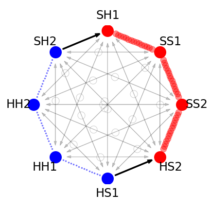
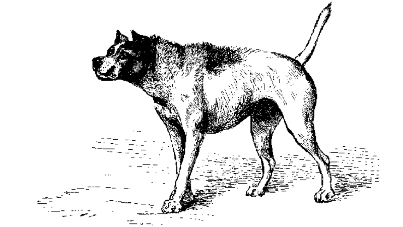

```{r setup, include=FALSE}
knitr::opts_chunk$set(
  echo = FALSE, cache = TRUE, fig.align = 'center'
)
```

```{r maur1, echo=F}

```

## Reprise on evolution

> "Generate and test" - Daniel Dennett.

<iframe width="560" height="315" src="https://www.youtube.com/embed/plVk4NVIUh8" frameborder="0" allow="accelerometer; autoplay; clipboard-write; encrypted-media; gyroscope; picture-in-picture" allowfullscreen></iframe>


## Definition of Religion

In this course we stipulate a meaning for "religion" as beliefs and practices regarding the supernatural.

## Methodological naturalism

We will not assume the existence of any supernatural being (e.g. Zeus) when explaining beliefs and practices regarding supernatural beings (e.g. Greek religion).

Methodological naturalism is a useful assumption: it has led to scientific progress.

However, methodological naturalism does not imply atheism. It is an assumption, not a result.

## The principle of consistency

We can be held accountable to our beliefs.

For example:

-   You believe that Abel Tasman is south of Wellington
-   You believe that maps can be trusted.
-   You look up Abel Tasman at 40.9347° S
-   You look up Wellington at 41.2865° S
-   Your beliefs are inconsistent

## The cognitive revolution

**Key idea: thinking is a kind of *information processing*.**

-   Cognitive scientists claim that both the brain and computers need to be approached abstractly and from a non-materialist point of view.
-   Thinking (and computers) involves transforming information through symbolic representation according to rules
-   Implication: to understand thinking requires understanding rules (not neurons or any other material "stuff")

```{r  light, layout="l-body-outset",  out.width = "1000px", fig.cap = "We perceive color constancy under different lightening condition, even as light frequencies vary. The algorthims that perform the transformations are a feature of our biological endowment."}

```

```{r  eyelight, layout="l-body-outset",  out.width = "1000px", fig.cap = "There are constraints on processing: the eyes in both images (left/right) reflecting at the same frequency of light, but we process the colours as different."}
knitr::include_graphics("eyelight.png")
```

## Language as mental organ

Consider the following sentences:

-   John saw Mary with Alice.
-   John saw Mary and Alice.

We can create questions: of this form

-   With whom did John see Mary?

But never of this form: \* And whom did John see Mary?

The rule: "No conjuct may be moved" appears to be a human universal. Children never learn such a rule.

(See: Ross, J.R. 1967. Constraints on variables in syntax. Doctoral dissertation, MIT (published as 'Infinite syntax!' Ablex, Norwood (1986)

The coordinate structure constraint: children never make the mistake in red sentence. Generally speaking, the class of all learnable grammars occupies a narrow bandwidth on the spectrum of possibility.

Ross, J.R. 1967. Constraints on variables in syntax. Doctoral dissertation, MIT (published as 'Infinite syntax!' Ablex, Norwood (1986)) "No conjuct may be moved"

## Travelling salesperson problems

What is the shortest path bewtween 10 New Zealand cities? If we attempt the calculation by brute force, we end up with the the following:

```{r echo = TRUE}
# The equation is 
# (n-1)!/2 
factorial(9)/2
```

It only takes counting paths between \~ 60 towns to arrive at the number of atoms in the universe.

```{r echo = TRUE}
# The equation is 
# (n-1)!/2 
factorial(60)/2
```


```{r  maps, layout="l-body-outset",  out.width = "1000px", fig.cap = ""}
knitr::include_graphics("maps.jpg")
```

For what appear to be simple tasks, the mind/brain quickly runs up against mathematical limits for information processing.

## Implications

What are the implications fof combinatorial explosion and the frame problem for psychology? (principle of consistency?)

## David Marr's levels

We can approach thinking at three levels (David Marr, Vision, 1982)

1.  Functional: the goals of the computation
2.  Rules: a representation of the inputs and outputs and the algorithms which transform one into the other (the computational principles)
3.  "Hardware" physically embodiment -- again the minds matter doesn't matter.

## Summary of approach

1.  Information processing approach: how does the brain transform information to enable thinking?

2.  Combinatorial explosion: the mind cannot review a universe of possibilities each time it solves a problem.

3.  Modularity of mind: thinking requires an assembly line approach: breaking down the problems in to smaller parts


## Evolutionary Psychology

-   Evolution might be able to clarify how thought is framed by:
-   Telling researchers what to look for?
-   Clarify otherwise puzzling aspects of human psychology.

```{r  avo1, layout="l-body-outset",  out.width = "1000px", fig.cap = "What does this tool do?"}
knitr::include_graphics("avo.png")
```

```{r  avo2, layout="l-body-outset",  out.width = "1000px", fig.cap = "Once we know the task, the design is functional design is obvious. Cosmides and Tooby's argue that reverse engineering the mindå has a similar benefit. The idea: recurrent taks in the envrinment of evolutionary adaptation have shaped how we think"}

```

## Wason selection task

Each card has a number on one side, and a patch of color on the other. Which card(s) must be turned over to test the idea that if a card shows an even number on one face, then its opposite face is red?

```{r  wason1, layout="l-body-outset",  out.width = "1000px", fig.cap = "Each card has a number on one side, and a patch of color on the other. Which card(s) must be turned over to test the idea that if a card shows an even number on one face, then its opposite face is red?"}
knitr::include_graphics("wason0.png")
```

Cosmides and Tooby argue for specialised "cheater detection" circuits.

Each card has an age on one side, and a drink on the other. Which card(s) must be turned over to test the idea that if you are drinking alcohol then you must be over 18?

```{r  wason2, layout="l-body-outset",  out.width = "1000px", fig.cap = "Each card has an age on one side, and a drink on the other. Which card(s) must be turned over to test the idea that if you are drinking alcohol then you must be over 18?"}
knitr::include_graphics("wason1.png")
```

Generalising, Cosmides and Tooby claim:

-   Principle 1. The brain is a physical system. It functions as a computer. Its circuits are designed to generate behavior that is appropriate to your environmental circumstances."

-   Principle 2. Our neural circuits were designed by natural selection to solve problems that our ancestors faced during our species' evolutionary history."

-   Principle 3. Consciousness is just the tip of the iceberg; most of what goes on in your mind is hidden from you. As a result, your conscious experience can mislead you into thinking that our circuitry is simpler that it really is. Most problems that you experience as easy to solve are very difficult to solve -- they require very complicated neural circuitry"

-   Principle 4. Different neural circuits are specialized for solving different adaptive problems."

-   Principle 5. Our modern skulls house a stone age mind."

## Application to Religion?

4th Century BCE: Xenophanes:

> The Ethiopians say that their gods are flat-nosed and black and the Thracians that theirs are fair and ruddy. But if cattle and horses and lions had hands and could create with their hands and achieve works like those of men, horses would render their conceptions of the gods like horses, and cattle like cattle, and each would depict bodies for them just like their own ...

```{r  face1, layout="l-body-outset",  out.width = "1000px", fig.cap = ""}
knitr::include_graphics("face.png")
```
```{r  face2, layout="l-body-outset",  out.width = "1000px", fig.cap = ""}
knitr::include_graphics("face2.png")
```

## Guthrie

-   Perception(BELIEF) = betting.
-   Perceiving humans is a safe bet.


+------------------------+---------------------+----------------------+
|                        |                     |                      |
|                        |                     |                      |
|                        | Payoff Not Perceive | Payoff Perceive      |
+========================+:===================:+======================+
| Person there           | Big cost            | Big Benefit          |
+------------------------+---------------------+----------------------+
| Person not there       | Neutral             | Small cost           |
|                        |                     |                      |
|                        |                     |                      |
+------------------------+---------------------+----------------------+

: Gurthie's wager

## Darwin on Anthropomorphism

> 'My dod, a full-grown and very sensible animal was lying on the law during a hot and still day; but at a little distance a slight breeze occasionally moved an open parasol, which would have been wholly disregarded by the dog, had anyone stood near it. As it was, every time that the parasol slightly moved, the dog growled fiercely and barked. He must, I think, have reasoned to himself in a rapid and unconscious manner, that movement without any apparent cause indicated the presence of some strange living agent, and no stranger had a right to be on his territory.' 
>
> -- Descent of Man, p.67


```{r  dog, layout="l-body-outset",  out.width = "1000px", fig.cap = ""}

```


## My interview of Stewart Guthrie a few years ago

<iframe width="560" height="315" src="https://www.youtube.com/embed/zSiSwgZej04" frameborder="0" allow="accelerometer; autoplay; clipboard-write; encrypted-media; gyroscope; picture-in-picture" allowfullscreen></iframe>


## Links to readings

Cosmides, Leda, and John Tooby. "Evolutionary psychology: A primer." (1997). [Website:](http://www.cep.ucsb.edu/primer.html)

Steven Mithen's very brief review from an archaeological perspective (3 pages): Mithen, S. (1997). The Adapted Mind: Evolutionary Psychology and the Generation of Culture. [PDF](https://www.dropbox.com/s/7wbd688uyfp0cu2/Mithen-1997_Reviewed-Work-The-Adapted-Mind-Evolutionary-Psychology.pdf?dl=0)

Guthrie, Stewart. "Spiritual beings: A Darwinian, cognitive account." Bulbulia et al., eds., Evolution of Religion (2008): 239-245. [PDF](https://www.dropbox.com/s/8xn1tnm0vqizdar/Guthrie2008.pdf?dl=0)
